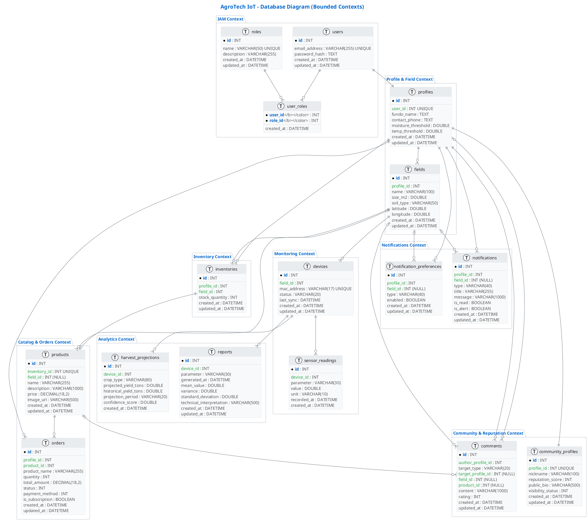

## 4.8.1. Database Diagrams.

```plantuml
@startuml
' ==================== LIGHT THEME CONFIGURATION ====================
skinparam backgroundColor #FFFFFF
skinparam defaultFontColor #333333
skinparam classFontColor #1A1A1A
skinparam classAttributeFontColor #555555
skinparam class {
    BackgroundColor #F8F9FA
    BorderColor #DEE2E6
    HeaderBackgroundColor #E9ECEF
    HeaderFontColor #0066CC
    FontColor #1A1A1A
}
skinparam package {
    BackgroundColor #FFFFFF
    BorderColor #CED4DA
    FontColor #0066CC
    FontStyle bold
}
skinparam stereotype {
    BackgroundColor #FFFFFF
    BorderColor #ADB5BD
    FontColor #0066CC
}
skinparam arrow {
    Color #6C757D
    FontColor #495057
    Thickness 1
}

title <color:#0066CC><size:18>AgroTech IoT - Database Diagram (Bounded Contexts)</size></color>

!define table(x) class x << (T,#F8F9FA) >>
!define primary_key(x) <b><color:#0066CC>x</color></b>
!define foreign_key(x) <color:#28A745>x</color>

hide methods
hide stereotypes

' ==================== IAM CONTEXT ====================
package "IAM Context" {
  table(users) {
    * primary_key(id) : INT
    --
    email_address : VARCHAR(255) UNIQUE
    password_hash : TEXT
    created_at : DATETIME
    updated_at : DATETIME
  }

  table(roles) {
    * primary_key(id) : INT
    --
    name : VARCHAR(50) UNIQUE
    description : VARCHAR(255)
    created_at : DATETIME
    updated_at : DATETIME
  }

  table(user_roles) {
    * foreign_key(primary_key(user_id)) : INT
    * foreign_key(primary_key(role_id)) : INT
    --
    created_at : DATETIME
  }
}

' ==================== PROFILE & FIELD CONTEXT ====================
package "Profile & Field Context" {
  table(profiles) {
    * primary_key(id) : INT
    --
    foreign_key(user_id) : INT UNIQUE
    fundo_name : TEXT
    contact_phone : TEXT
    moisture_threshold : DOUBLE
    temp_threshold : DOUBLE
    created_at : DATETIME
    updated_at : DATETIME
  }

  table(fields) {
    * primary_key(id) : INT
    --
    foreign_key(profile_id) : INT
    name : VARCHAR(100)
    size_m2 : DOUBLE
    soil_type : VARCHAR(50)
    latitude : DOUBLE
    longitude : DOUBLE
    created_at : DATETIME
    updated_at : DATETIME
  }
}

' ==================== MONITORING CONTEXT ====================
package "Monitoring Context" {
  table(devices) {
    * primary_key(id) : INT
    --
    foreign_key(field_id) : INT
    mac_address : VARCHAR(17) UNIQUE
    status : VARCHAR(20)
    last_sync : DATETIME
    created_at : DATETIME
    updated_at : DATETIME
  }

  table(sensor_readings) {
    * primary_key(id) : INT
    --
    foreign_key(device_id) : INT
    parameter : VARCHAR(30)
    value : DOUBLE
    unit : VARCHAR(10)
    recorded_at : DATETIME
    created_at : DATETIME
  }
}

' ==================== ANALYTICS CONTEXT ====================
package "Analytics Context" {
  table(reports) {
    * primary_key(id) : INT
    --
    foreign_key(device_id) : INT
    parameter : VARCHAR(30)
    generated_at : DATETIME
    mean_value : DOUBLE
    variance : DOUBLE
    standard_deviation : DOUBLE
    technical_interpretation : VARCHAR(500)
    created_at : DATETIME
    updated_at : DATETIME
  }

  table(harvest_projections) {
    * primary_key(id) : INT
    --
    foreign_key(device_id) : INT
    crop_type : VARCHAR(80)
    projected_yield_tons : DOUBLE
    historical_yield_tons : DOUBLE
    projection_period : VARCHAR(20)
    confidence_score : DOUBLE
    created_at : DATETIME
  }
}

' ==================== CATALOG & ORDERS CONTEXT ====================
package "Catalog & Orders Context" {
  table(products) {
    * primary_key(id) : INT
    --
    foreign_key(inventory_id) : INT UNIQUE
    foreign_key(field_id) : INT (NULL)
    name : VARCHAR(255)
    description : VARCHAR(1000)
    price : DECIMAL(18,2)
    image_url : VARCHAR(500)
    created_at : DATETIME
    updated_at : DATETIME
  }

  table(orders) {
    * primary_key(id) : INT
    --
    foreign_key(profile_id) : INT
    foreign_key(product_id) : INT
    product_name : VARCHAR(255)
    quantity : INT
    total_amount : DECIMAL(18,2)
    status : INT
    payment_method : INT
    is_subscription : BOOLEAN
    created_at : DATETIME
    updated_at : DATETIME
  }
}

' ==================== INVENTORY CONTEXT ====================
package "Inventory Context" {
  table(inventories) {
    * primary_key(id) : INT
    --
    foreign_key(profile_id) : INT
    foreign_key(field_id) : INT
    stock_quantity : INT
    created_at : DATETIME
    updated_at : DATETIME
  }
}

' ==================== NOTIFICATIONS CONTEXT ====================
package "Notifications Context" {
  table(notifications) {
    * primary_key(id) : INT
    --
    foreign_key(profile_id) : INT
    foreign_key(field_id) : INT (NULL)
    type : VARCHAR(40)
    title : VARCHAR(255)
    message : VARCHAR(1000)
    is_read : BOOLEAN
    is_alert : BOOLEAN
    created_at : DATETIME
    updated_at : DATETIME
  }

  table(notification_preferences) {
    * primary_key(id) : INT
    --
    foreign_key(profile_id) : INT
    foreign_key(field_id) : INT (NULL)
    type : VARCHAR(40)
    enabled : BOOLEAN
    created_at : DATETIME
    updated_at : DATETIME
  }
}

' ==================== COMMUNITY & REPUTATION CONTEXT ====================
package "Community & Reputation Context" {
  table(community_profiles) {
    * primary_key(id) : INT
    --
    foreign_key(profile_id) : INT UNIQUE
    nickname : VARCHAR(100)
    reputation_score : INT
    public_bio : VARCHAR(500)
    visibility_status : INT
    created_at : DATETIME
    updated_at : DATETIME
  }

  table(comments) {
    * primary_key(id) : INT
    --
    foreign_key(author_profile_id) : INT
    target_type : VARCHAR(20)
    foreign_key(target_profile_id) : INT (NULL)
    foreign_key(field_id) : INT (NULL)
    foreign_key(product_id) : INT (NULL)
    content : VARCHAR(1000)
    rating : INT
    created_at : DATETIME
    updated_at : DATETIME
  }
}

' ==================== RELATIONSHIPS ====================
' IAM Relationships
users ||--o{ user_roles
roles ||--o{ user_roles
users ||--|| profiles

' Profile & Field Relationships
profiles ||--o{ fields

' Monitoring Relationships
fields ||--o{ devices
devices ||--o{ sensor_readings

' Analytics Relationships
devices ||--o{ reports
devices ||--o{ harvest_projections

' Catalog & Orders Relationships
fields |o--o{ products
profiles ||--o{ orders
products ||--o{ orders

' Inventory Relationships
profiles ||--o{ inventories
fields ||--o{ inventories
inventories ||--o| products

' Notifications Relationships
profiles ||--o{ notifications
fields |o--o{ notifications
profiles ||--o{ notification_preferences
fields |o--o{ notification_preferences

' Community Relationships
profiles ||--|| community_profiles
profiles ||--o{ comments
profiles |o--o{ comments
fields |o--o{ comments
products |o--o{ comments

@enduml
```